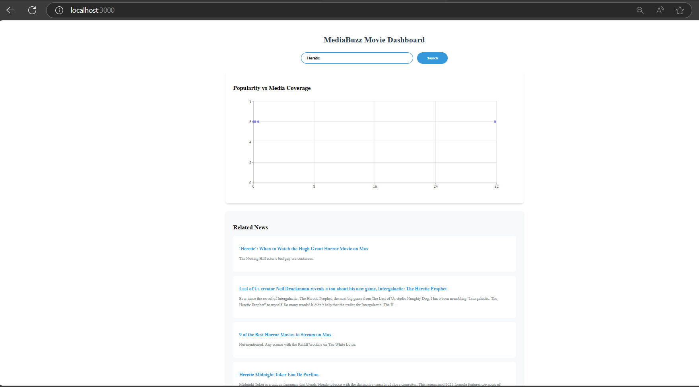

# 🎬 MediaBuzz Movie Dashboard 📰

## Dashboard Screenshot


A modern full-stack dashboard that correlates movie popularity with media coverage. Built with React, Node.js, and Docker.  

---

## ✨ Features

- **Real-Time Movie Trends** - Top 10 trending movies from TMDB API
- **News Integration** - Latest articles about movies from NewsAPI
- **Interactive Visualizations** - Scatter plots, news feeds, and search
- **Dockerized** - One-command deployment with Docker Compose
- **Mobile-Friendly** - Responsive design for all devices

---

## 🚀 Quick Start

### Prerequisites
- [Docker](https://docs.docker.com/get-docker/) + [Docker Compose](https://docs.docker.com/compose/install/)
- API Keys:  
  [🔑 Get TMDB API Key](https://www.themoviedb.org/settings/api) |
  [📰 Get NewsAPI Key](https://newsapi.org/register)

### Installation
```bash
# Clone repository
git clone https://github.com/your-username/media-buzz-dashboard.git
cd media-buzz-dashboard

# Configure API keys
cp docker-compose.yml.sample docker-compose.yml
nano docker-compose.yml  # Add your API keys
```

### Running the Project
```bash
# Start containers
docker-compose up --build

# Access applications:
# Frontend → http://localhost:3000
# Backend API → http://localhost:5000/api/data
```

---

## 🛠️ Tech Stack

### Frontend
- React
- Recharts
- Axios

### Backend
- Node.js
- Express

### Infrastructure
- Docker

---

## 📂 Project Structure
```
media-buzz-dashboard/
├── backend/               # Node.js service
│   ├── server.js          # API endpoints
│   └── Dockerfile
├── frontend/              # React dashboard
│   ├── src/               # Components & styles
│   └── Dockerfile
└── docker-compose.yml     # Container orchestration
```

---

## 🔍 Usage Guide

### View Trending Movies
Automatically loads top 10 movies on initial visit.


Type any movie title in the search bar to analyze its media impact.

### Interpret Data
- **X-Axis:** TMDB Popularity Score
- **Y-Axis:** Number of News Mentions
- **Dot Size:** Recent release status

---

## 📜 API Documentation

| Service | Documentation | Rate Limits |
|---------|--------------|-------------|
| TMDB | [API Docs](https://developers.themoviedb.org/3/getting-started/introduction) | 40 req/10s |
| NewsAPI | [API Docs](https://newsapi.org/docs) | 100 req/day |

---

## ⚠️ Troubleshooting

### Common Issues
- **Network Error**: Verify API keys in `docker-compose.yml`
- **CORS Errors**: Ensure backend is running on port `5000`
- **No Data**: Check API rate limits

### Reset Containers
```bash
docker-compose down -v --remove-orphans
```

---
